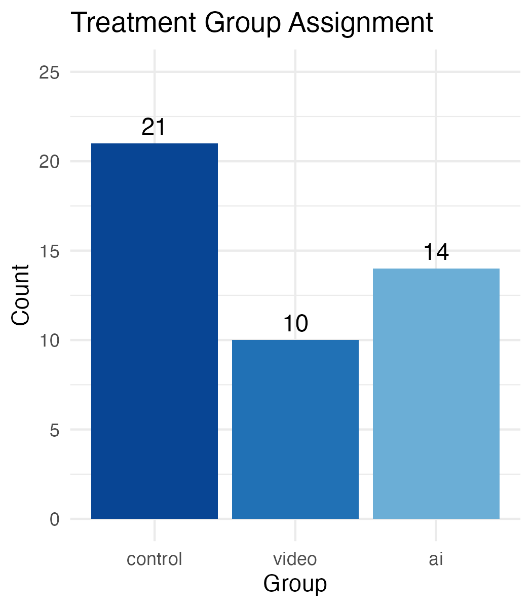

```{r setup, include=FALSE}
library(dplyr)
library(tidyverse)
knitr::opts_chunk$set(echo = TRUE)

load("./data/processed/sudoku_summary.RData")
```

Does learning with an AI tutor improve performance of mastering a new puzzle compared to self-discovery or video tutorial? 

# Abstract

Large language models (LLMs) have become the go-to option for students as a personal tutor to learn new material in classes. The potential trade off of using LLMs is solving short term problems without internalizing and learning the underlying material to be able to repeat without continued assistance of AI. Prior experiments (Lyu 2024, Chen 2025, Goel & Lieb, 2024) indicate positive results in AI tutors helping students improve their grades compared to students who did not use an AI tutor. However, there is an indication that those improvements diminish on tests when the AI is not accessible compared to unproctored homework assignments. This experiment investigates AI-assisted learning to understand how well students retain understanding when using an AI assistant to study compared to unassisted study and non-personalized video tutorial. We introduce participants to a new type of puzzle and provide an AI tutor or video tutorial to help them learn in the treatment groups. The analysis compares the portion who solve the second puzzle in each group and solve time for those who complete it.  

The results of this study show that the control group without any assistance performed the worst on the second puzzle. The AI assistant group and the video tutorial both showed improvements compared to the control group, though there was no significant difference detected between the treatment groups. 

# Background/Related Research

This experiment examines AI-assisted learning. This experiment looks specifically at the learning benefits and possible over-reliance on AI when learning a new cognitive task by testing how people perform when that AI assistant is taken away. Chen et al. (2025) studied the effectiveness of an AI tutoring system for mathematical proof writing. The AI-assisted group performed better on homework assignments than the control group, but the impact measured on exams without the LLM was found to be insignificant. There is a risk that students over-relied on the AI when studying and did not improve learning comprehension. The time spent on tasks was measured to be insignificant between the two groups. A semester-long field study of 50 computer science university students found that “students who used CodeTutor (an OpenAI based tutor) achieved statistically significant improvements in their final scores compared to peers.

Our mechanism is structured around the theory that even in proctored settings like classroom exams where students have no access to assistant tools like ChatGPT or YouTube tutorials, assisted learning can still bear benefits based on tutor-like impacts where students learn and retain the information for use in live unassisted settings. To explicitly test our mechanism, we present subjects with a second puzzle where no one gets access to additional assistance, like a proctored setting, and their performance is measured between the three groups. The second puzzle aims to measure how people retain understanding while using an LLM to study. In a controlled environment, this experiment will measure if there is improvement from AI-assisted learning or if there are effects of over or under-reliance during the learning process. If the tutor is successful in helping users understand the puzzle mechanics, then more users should be able to solve it, and do so in a faster time. If instead users over-rely on AI while learning, there will be no difference in performance or possibly a decline relative to the control or video learning group.


# Hypothesis + Theory

Null Hypothesis: Learning with an AI tutor has no effect on performance of completing a new puzzle compared to self-discovery or video tutorial. 

Alternative Hypothesis: Learning with an AI tutor improves performance by reducing the completion time of a new puzzle by 3 minutes and a video tutorial by 1.5 minutes.

The treatment we employ is expected to improve a subject’s puzzle-solving performance through an AI tutor’s guided and personalizable teaching model. The AI-tutor is able to adapt to a learner’s exact questions and learning needs unlike a non-personalized method such as tutorial video. A study of 50 students was evaluated using a personalized chatbot in three settings: a general purpose model, a tutor model, and a feedback model. The tutor model chatbot resulted in the best user-experience with 70% of students planning to use the tool in future physics assignments (Goel & Lieb, 2024). However the AI-tutor needs to balance over-reliance (accepting incorrect AI feedback) and under-reliance (rejecting correct AI feedback), which can result in adverse learning outcomes.


# Experiment Design

## Potential Outcomes

Each user has a potential outcome for each of the 3 treatment conditions - control (D = 0), video (D = 1), AI tutor (D = 2). There are 2 treatment effects under investigation - the effect of the video ($\tau_{video}$) and the effect of the AI tutor ($\tau_{ai}$). All users had uniform probability of being assigned into each of the treatments. The control condition is the baseline that we compare both the video and AI tutor against. We are not examining the potential treatment effect of the video compared to the AI tutor because the treatment effect is better understood by comparing it to a no aids base case. 
$E[Y(1)] - E[Y(0)]  = E[Y(1) - Y(0)] = E[\tau_{video}]$
$E[Y(2)] - E[Y(0)]  = E[Y(2) - Y(0)] = E[\tau_{ai}]$
There are 3 outcome variables that are tracked in the data so there are a total of 6 different measurable treatment effects:
Video treatment: $\tau_{completion-video}, \tau_{actions-video}, \tau_{time-video}$
AI Tutor treatment: $\tau_{completion-ai}, \tau_{actions-ai}, \tau_{time-ai}$


## Randomization


The application set a random treatment condition at the time the subject loaded the page and the randomization was stored in the user session. That way if the user decided to refresh the page for any reason they would still be assigned to the same condition.  We used a JavaScript random function to choose between one of the 3 treatments. Each randomization was an independent run of the randomization function, so the prior results did not change the probabilities of the next user. Each of the 3 conditions had uniform probability of being chosen. 

```{r group-assignment, echo=FALSE, fig.cap="Figure 1: Treatment Group Assignment"}
n_control_pct <- round(n_control / n_total * 100, 1)
n_video_pct   <- round(n_video   / n_total * 100, 1)
n_ai_pct      <- round(n_ai      / n_total * 100, 1)


```

The randomization did not produce a uniform distribution across all groups. The control group had `r n_control` compared to `r n_video` assigned to video and `r n_ai` assigned to AI Tutor. With total participation of `r n_total` subjects, the data distribution is unbalanced with `r n_control_pct`% assigned to control, `r n_video_pct`%  to video, and `r n_ai_pct`% to AI tutor.

## Treatment

The subjects were divided into two treatments and one control group.  The subject solved a Killer Sudoku puzzle (Figure 1), which is a variant of sudoku with some additional rules - namely the puzzle board features boxes that cover multiple cells with a number that is the sum of all the digits in the box. The treatment offered subjects 3 different ways to learn the rules of the puzzle before they were tested on their understanding of the puzzle rules and strategy.

The AI tutor treatment used an embedded chat window using a ChatGPT chat bot with a specific prompt (full prompt in the Appendix). The users were allowed to ask the chatbot questions about the rules of the game as they interacted with the first puzzle. The chat bot was instructed to be a tutor and not give away any information but rather they to guide the user to discovering rules and strategies. 

The second treatment group experienced a non-personalized video tutorial to solve a puzzle. The video showed an example puzzle and showed how the rules of the game are reflected in the puzzle design. It also covered some basic strategies on how to solve the puzzle.

The control group did not have any learning assistance and was asked to solve the puzzle using their existing skills and knowledge.

All subjects were assigned treatment before completing their practice puzzle. Those in the treatment groups can use their respective treatments as much as they would like during the learning phase. Once a subject has completed their practice puzzle, the web application showed them to a second puzzle, which will be completed with no learning aids whatsoever. The users still had access to the basic list of rules, but they did not have the AI tutor or the video tutorial. All users were presented with the exact same puzzles for the learnign phase and a different puzzle for the test phase which was also consistent across conditions.


The experiment was set up in a custom web application. The users were assigned to the treatment condition on page load and were presented with the practice puzzle along with the 3 treatment conditions. All users received the same practice puzzle, the only difference was the level of instruction provided through the treatments 1) no assistance, 2) a short tutorial video, or 3) an AI tutor. The video  and puzzle were embedded into the page so users would not need to go off the page to participate in the experiment. The AI tutor was also embedded in the page so the users would be able to access the tutor and the puzzle simultaneously. While we timed the puzzle for our results, the users were instructed that the purpose was to understand the rules to be used on a test puzzle later. Users could continue to the next step at any point.
The measurements that can be assessed are the amount of time the users spend in the learning phase and if they successfully complete the introduction puzzle or not.
After the completion of the learning phase, users saw a confirmation page telling them they would have a test puzzle without aids. All users were presented with the same test puzzle to solve, but subjects who watched the video or used the AI tutor will not be allowed to use their aid. In the puzzle users were able to add notes to the puzzle board to aid with solving, and they had a button available to quit at any point. While we did not want to encourage users to give up, we decided it would be preferable to have the user take a confirmative action to give up rather than just abandoning the puzzle. 


## Compliance Checks

The participants’ results are stored in a Google Sheets by Vercel and includes columns such as ‘puzzle1TabSwitches’, ‘puzzle2TabSwitches’, and ‘aiMessageCount’. Tab switch columns can help us evaluate whether a participant may have deviated from their respective treatment group by searching for puzzle-solving information elsewhere or if this caused other deviant behavior which may impact the estimated treatment effect. 

The AI message count column can help us evaluate whether participants assigned to the AI Tutor group actually utilized the assigned treatment for assistance in learning how to solve the puzzle. We recorded the full chat history of all participants who interacted with with AI tutor to see what types of conversations they had. Of the X people who were assigned to the AI tutor group, 5 sent messages to the chat bot. 

We also tracked the amount of time spent on the first puzzle during the learning phase. The video was 4:39 long, so any video participant who did not spend at least that amount of time on the page would not have watched the full video. Of the X participants who were assigned to the video group, 2 spent enough time on the page to have watched the video in full. We were not able to detect if the user clicked play on the video due to YouTube iframe restrictions.

Of the `r n_ai` people assigned to the AI tutor group, `r n_ai_compliant` sent messages to the chat bot, a compliance rate of `r round(compliance_rate_ai,0)`%.

Of the `r n_video` participants assigned to the video group, `r n_video_compliant` spent enough time on the page to have watched the video in full, a compliance rate of `r round(compliance_rate_video,0)`%.


```{r tabswitches, include=FALSE}
tabs_control <- tab_switches$mean_tab_switches[tab_switches$group == "control"]
tabs_video <- tab_switches$mean_tab_switches[tab_switches$group == "video"]
tabs_ai <- tab_switches$mean_tab_switches[tab_switches$group == "ai"]
```
Tab switch behavior was minimal across all groups. The mean number of tab switches during the test puzzle was `r tabs_control` for control, `r tabs_video` for video, and `r tabs_ai` for the AI tutor group. No group had a maximum exceeding 4 tab switches, and the majority of participants recorded zero switches, suggesting that tab switching did not represent a meaningful compliance concern.


# Results

There are 3 outcomes that were tracked with the results of the puzzle - the amount of time spent solving the second puzzle, successful completion of the second puzzle, and the number of actions taken on the puzzle board.
A solver who successfully understands the rules and strategies would have a lower time, take fewer actions, and would have solved the puzzle. 

## Data

## Models

# Conclusion

# Appendix

# References
Chen, E., Li, J., Huang, S., Tang, X., Lin, J., Carvalho, P., & Koedinger, K. R. (2025). AI knows best? The paradox of expertise, AI‑reliance, and performance in educational tutoring decision‑making tasks. arXiv. https://arxiv.org/abs/2509.16772 

Lieb, A., & Goel, T. (2024). Student Interaction with NewtBot: An LLM-as-tutor Chatbot for Secondary Physics Education. Association for Computing Machinery, 1–8. https://doi.org/10.1145/3613905.3647957 

Lyu, W., Wang, Y., Chung, T., Sun, Y., & Zhang, Y. (2024). Evaluating the Effectiveness of LLMs in Introductory Computer Science Education: A Semester-Long Field Study. Association for Computing Machinery, 63–74. https://doi.org/10.1145/3657604.3662036 

