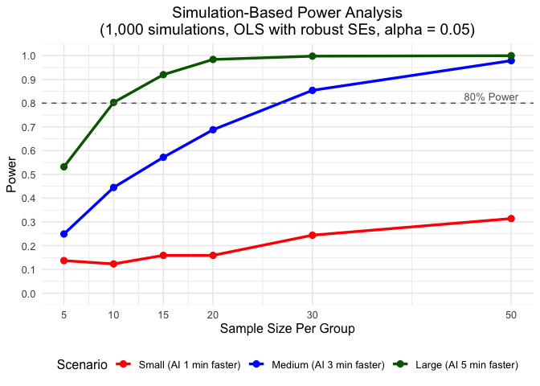
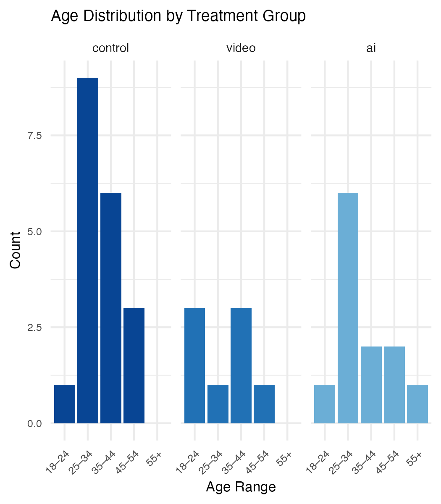
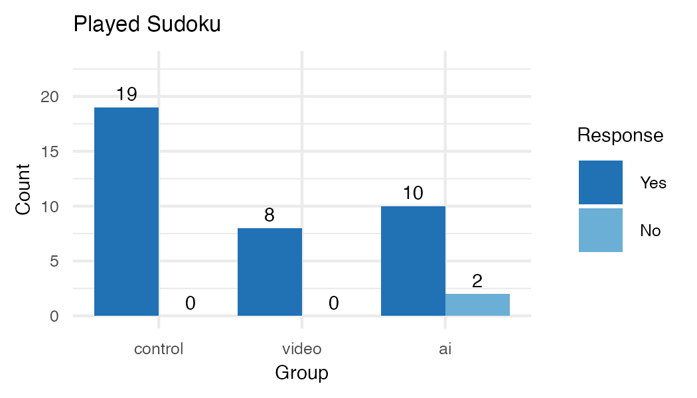
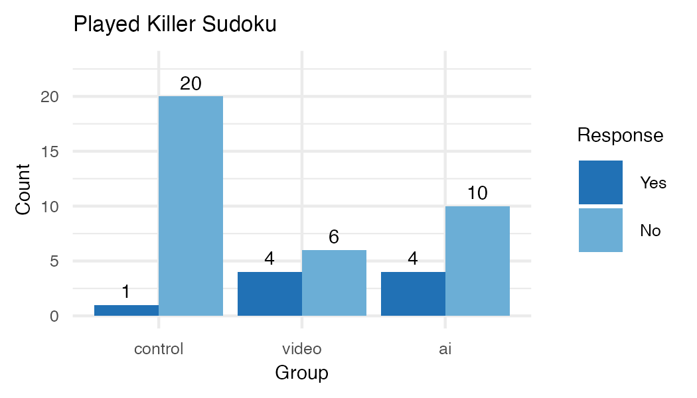
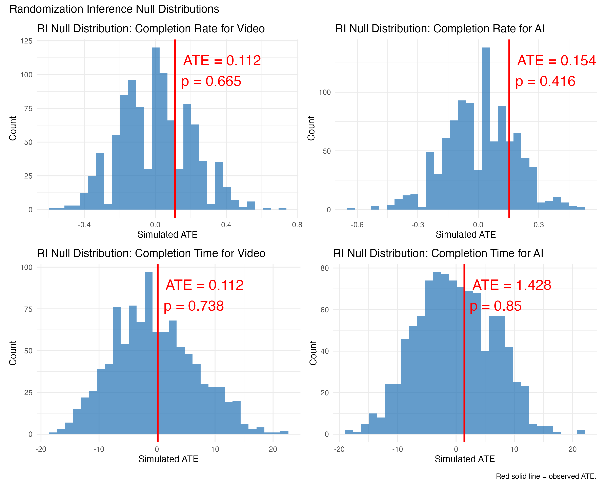
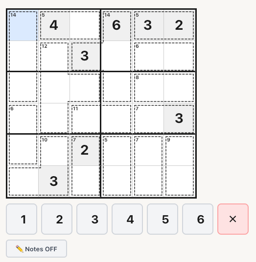
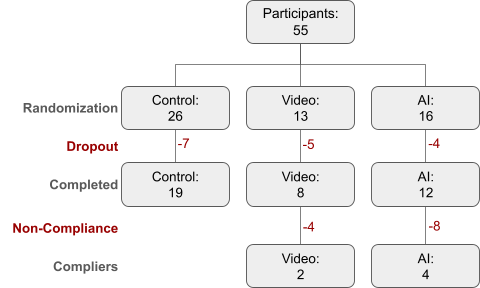
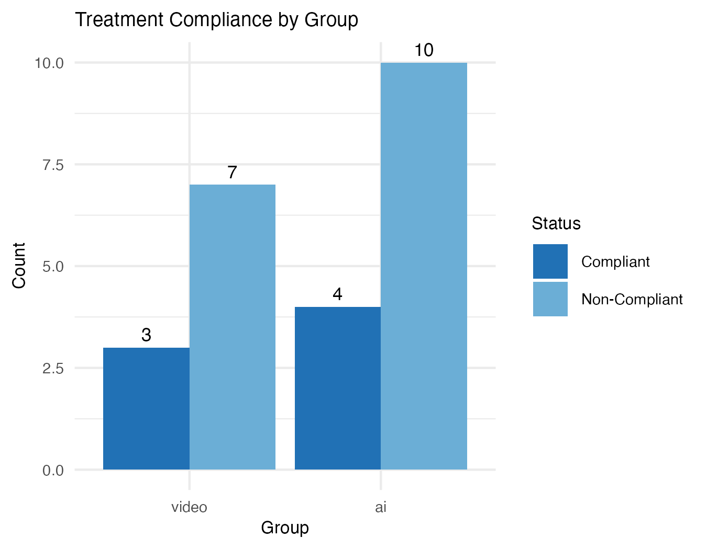
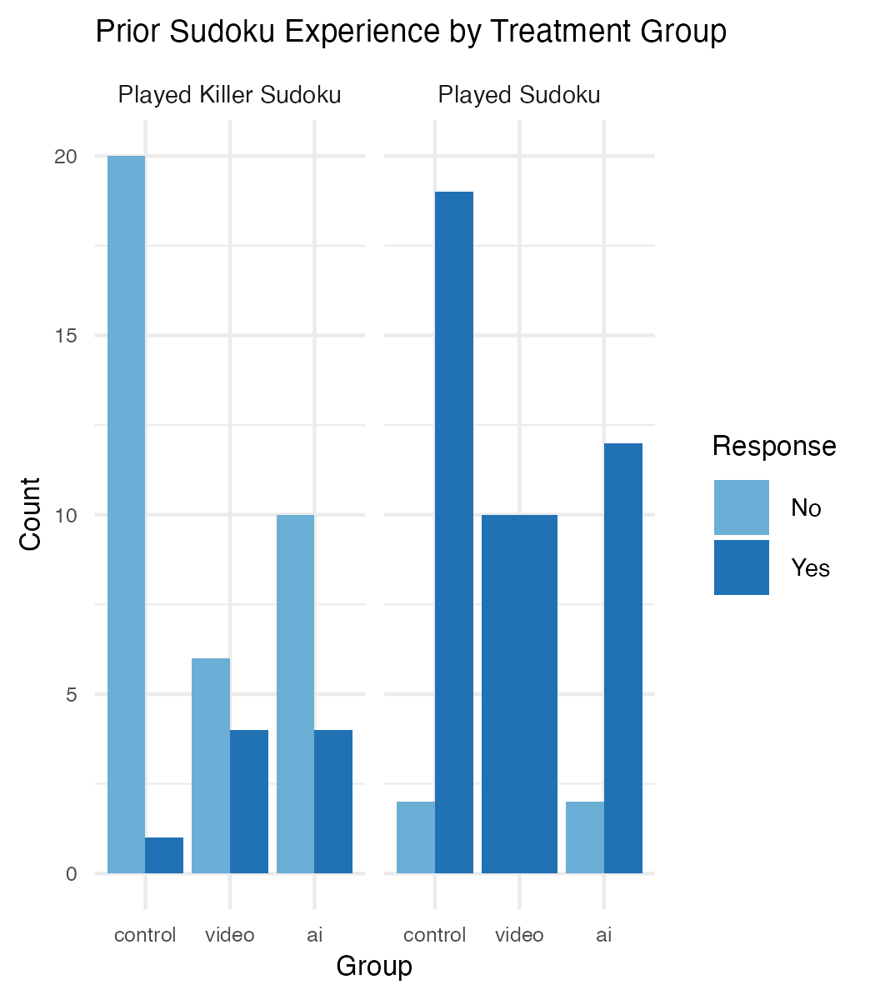

```{r setup, include=FALSE}
library(dplyr)
library(tidyverse)
library(sandwich)
library(stargazer)
library(lmtest)
library(AER)
library(kableExtra)

knitr::opts_chunk$set(echo = FALSE, fig.pos = "H", out.extra = "")

load("./data/processed/analysis_results.RData")
load("./data/processed/sudoku_summary.RData")
load("./data/processed/ri_results.RData")
```

\newpage

**_Does learning with an AI tutor improve performance of mastering a new puzzle compared to self-discovery or video tutorial?_**

# Abstract

Large language models (LLMs) have become the go-to option for students as a personal tutor to learn new material in classes. The potential trade off of using LLMs is solving short term problems without internalizing and learning the underlying material to be able to repeat without continued assistance of AI. Prior experiments (Lyu 2024, Chen 2025, Goel & Lieb, 2024) indicate positive results in AI tutors helping students improve their grades compared to students who did not use an AI tutor. However, there is an indication that those improvements diminish on tests when the AI is not accessible compared to unproctored homework assignments. This experiment investigates AI-assisted learning to understand how well students retain understanding when using an AI assistant to study compared to unassisted study and non-personalized video tutorial. We introduce participants to a new type of puzzle and provide an AI tutor or video tutorial to help them learn in the treatment groups. The analysis compares the portion who solve the second puzzle in each group and solve time for those who complete it.  

The results of this study show that the control group without any assistance performed the worst on the second puzzle. The AI assistant group and the video tutorial both showed improvements compared to the control group, though there was no significant difference detected between the treatment groups. 

# Background/Related Research

This experiment examines AI-assisted learning. This experiment looks specifically at the learning benefits and possible over-reliance on AI when learning a new cognitive task by testing how people perform when that AI assistant is taken away. Chen et al. (2025) studied the effectiveness of an AI tutoring system for mathematical proof writing. The AI-assisted group performed better on homework assignments than the control group, but the impact measured on exams without the LLM was found to be insignificant. There is a risk that students over-relied on the AI when studying and did not improve learning comprehension. The time spent on tasks was measured to be insignificant between the two groups. A semester-long field study of 50 computer science university students found that “students who used CodeTutor (an OpenAI based tutor) achieved statistically significant improvements in their final scores compared to peers.

Our mechanism is structured around the theory that even in proctored settings like classroom exams where students have no access to assistant tools like ChatGPT or YouTube tutorials, assisted learning can still bear benefits based on tutor-like impacts where students learn and retain the information for use in live unassisted settings. To explicitly test our mechanism, we present participants with a second puzzle where no one gets access to additional assistance, like a proctored setting, and their performance is measured between the three groups. The second puzzle aims to measure how people retain understanding while using an LLM to study. In a controlled environment, this experiment will measure if there is improvement from AI-assisted learning or if there are effects of over or under-reliance during the learning process. If the tutor is successful in helping participants understand the puzzle mechanics, then more participants should be able to solve it, and do so in a faster time. If instead participants over-rely on AI while learning, there will be no difference in performance or possibly a decline relative to the control or video learning group.


# Experiment Design

## Pilot Power Analysis 

We conducted a simulation-based power analysis from an initial pilot study to inform the design of the experiment prior to deploying a final model. This pilot study consisted of 10 participants randomly assigned to one of the three conditions and was simulated 1000 times using OLS regression. The power generated by the experiment depended on three scenarios based on pilot data collected by the team. The results of the analysis represented a range of plausible treatment effects on puzzle completion time when comparing the AI tutor group to the control group: 1. Small effect (-1 minute) 2. Medium effect (-3 minutes) 3. Large effect (-5 minutes). To manage the purpose of the experiment and have a consistent comparison to measure the effect of the AI tutor, the video tutorial group was assumed to have half the effect of the AI tutor group in each scenario. Based on power analysis for these scenarios (Figure \@ref(fig:power-analysis-results)), we anticipated the experiment could generate at least 80% power, given we recruit at least N=30 per group with a resultant medium-level or large-level treatment effect.

```{r power-analysis-results, echo=FALSE, fig.cap="Simulation-based Power Analysis Results", fig.pos='H', out.width='100%', fig.align='center'}

```

## Participant Population

Based on the results of the initial power analysis with pilot data, we aimed to recruit at least 100 UC Berkeley School of Information students and alumni. This subject count requirement would project to satisfy our analysis results that would require at least 30 people per treatment condition, with an additional 10% to attempt to cover possible attrition. The experiment instructions and link to the web application were shared on the UC Berkeley School of Information slack work space. This is accessible to current students and alumni. Other subjects that were considered for the experiment were personal friends, family members, coworkers, and paid crowd sourced research participants. We considered using a paid source such as Prolific, but all agreed that the cost would be prohibitive given the scope of the course. We scoped down from distributing the experiment in our social circles to tighten the experiment population into one that could result in practical significance. The motivation behind the experiment began with a discussion of the use of LLMs by students to assist in learning, so deploying to students and alumni fit the target audience to study. Additionally, scoping down from additional participants would reduce variance in the demographics of participants and increase the statistical power of the causal results. 

## Treatment

The participants were divided into two treatments and one control group.  The participant solved a Killer Sudoku puzzle (Figure \@ref(fig:participant-flow)), which is a variant of Sudoku with some additional rules - namely the puzzle board features boxes that cover multiple cells with a number that is the sum of all the digits in the box. The treatment offered participants 3 different ways to learn the rules of the puzzle before they were tested on their understanding of the puzzle rules and strategy.

The AI tutor treatment used an embedded chat window using a ChatGPT chat bot with a specific prompt (full prompt in the Appendix). The participants were allowed to ask the chat bot questions about the rules of the game as they interacted with the first puzzle. The chat bot was instructed to be a tutor and not give away any information but rather they to guide the participant to discovering rules and strategies. 

The second treatment group experienced a non-personalized video tutorial on how to solve a killer Sudoku puzzle. The video showed an example puzzle and showed how the rules of the game are reflected in the puzzle design. It also covered some basic strategies on how to solve the puzzle.

The control group did not have any learning assistance and was asked to solve the puzzle using their existing skills and knowledge.

All participants were assigned treatment before completing their practice puzzle. Those in the treatment groups can use their respective treatments as much as they would like during the learning phase. Once a participant has completed their practice puzzle, the web application showed them to a second puzzle, which will be completed with no learning aids whatsoever. The participants still had access to the basic list of rules, but they did not have the AI tutor or the video tutorial. All participants were presented with the exact same puzzles for the learning phase and a different puzzle for the test phase which was also consistent across conditions.


The experiment was set up in a custom web application. The participants were assigned to the treatment condition on page load and were presented with the practice puzzle along with the 3 treatment conditions. All participants received the same practice puzzle, the only difference was the level of instruction provided through the treatments 1) no assistance, 2) a short tutorial video, or 3) an AI tutor. The video  and puzzle were embedded into the page so participants would not need to go off the page to participate in the experiment. The AI tutor was also embedded in the page so the participants would be able to access the tutor and the puzzle simultaneously. While we timed the puzzle for our results, the participants were instructed that the purpose was to understand the rules to be used on a test puzzle later. participants could continue to the next step at any point.
The measurements that can be assessed are the amount of time the participants spend in the learning phase and if they successfully complete the introduction puzzle or not.
After the completion of the learning phase, participants saw a confirmation page telling them they would have a test puzzle without aids. All participants were presented with the same test puzzle to solve, but participants who watched the video or used the AI tutor will not be allowed to use their aid. In the puzzle participants were able to add notes to the puzzle board to aid with solving, and they had a button available to quit at any point. While we did not want to encourage participants to give up, we decided it would be preferable to have the participant take a confirmative action to give up rather than just abandoning the puzzle. 

## Potential Outcomes

Each participant has a potential outcome for each of the 3 treatment conditions - control (D = 0), video (D = 1), AI tutor (D = 2). There are 2 treatment effects under investigation - the effect of the video ($\tau_{video}$) and the effect of the AI tutor ($\tau_{ai}$). All participants had uniform probability of being assigned into each of the treatments. The control condition is the baseline that we compare both the video and AI tutor against. We are not examining the potential treatment effect of the video compared to the AI tutor because the treatment effect is better understood by comparing it to a no aids base case. 
$E[Y(1)] - E[Y(0)]  = E[Y(1) - Y(0)] = E[\tau_{video}]$
$E[Y(2)] - E[Y(0)]  = E[Y(2) - Y(0)] = E[\tau_{ai}]$
There are 3 outcome variables that are tracked in the data so there are a total of 6 different measurable treatment effects:
Video treatment: $\tau_{completion-video}, \tau_{time-video}$
AI Tutor treatment: $\tau_{completion-ai}, \tau_{time-ai}$

# Hypothesis + Theory

Null Hypothesis: Learning with an AI tutor has no effect on performance of completing a new puzzle compared to self-discovery or video tutorial. 

Alternative Hypothesis: Compared to the control group, the AI tutor reduces puzzle completion time by 3 minutes and the video tutorial reduces it by 1.5 minutes.

The treatment we employ is expected to improve a participant’s puzzle-solving performance through an AI tutor’s guided and personalizable teaching model. The AI-tutor is able to adapt to a learner’s exact questions and learning needs unlike a non-personalized method such as tutorial video. A study of 50 students was evaluated using a personalized chatbot in three settings: a general purpose model, a tutor model, and a feedback model. The tutor model chatbot resulted in the best user-experience with 70% of students planning to use the tool in future physics assignments (Goel & Lieb, 2024). However the AI-tutor needs to balance over-reliance (accepting incorrect AI feedback) and under-reliance (rejecting correct AI feedback), which can result in adverse learning outcomes.

# Data

## Randomization

The application set a random treatment condition at the time the participant loaded the page and the randomization was stored in each user session. That way, if the participant decided to refresh the page for any reason they would still be assigned to the same condition.  We used a JavaScript random function to choose between one of the 3 treatments. Each randomization was an independent run of the randomization function, so the prior results did not change the probabilities for the next generated user session. Each of the 3 conditions had uniform probability of being chosen. 

There were 55 unique participants who clicked consent and reached the treatment page. Initial randomization resulted in 26 control, 13 video, and 16 AI participants. Participants were dropped from the analysis if they spent less than 60 seconds on the learning page and had no puzzle 2 data, as they could not have received any level of treatment in that time frame. One participant with a time of 2 hours was also dropped due to abandonment. Remaining participants with missing puzzle 2 completion data were treated as not having completed the puzzle. After cleaning, 19 control, 8 video, and 12 AI participants remained (Figure \@ref(fig:participant-flow)).

```{r group-assignment, echo=FALSE}
n_control_pct <- round(n_control / n_total * 100, 1)
n_video_pct   <- round(n_video   / n_total * 100, 1)
n_ai_pct      <- round(n_ai      / n_total * 100, 1)
```

The randomization did not produce a uniform distribution across all groups (Figure \@ref(fig:group-assignment-chart)). The control group had `r n_control` compared to `r n_video` assigned to video and `r n_ai` assigned to AI Tutor. With total participation of `r n_total` participants, the data distribution is unbalanced with `r n_control_pct`% assigned to control, `r n_video_pct`%  to video, and `r n_ai_pct`% to AI tutor.

## Covariate Balance Checks
```{r covariate_balance age, include=FALSE}

```
Age distribution was roughly similar across groups, with the majority of participants falling in the 25-34 and 35-44 age ranges. 

```{r covariate_balance experience, include=FALSE}


```

Prior Sudoku experience was high and consistent across all groups, with `r exp_control$pct_sudoku`%, `r exp_video$pct_sudoku`%, and `r exp_ai$pct_sudoku`% of control, video, and AI tutor participants respectively reporting prior Sudoku experience. This covariate is unlikely to confound the results because it is relatively balanced.

However, prior Killer Sudoku experience represents a more meaningful imbalance. The video group had `r exp_video$pct_killer_sudoku`% of participants with prior Killer Sudoku experience compared to `r exp_control$pct_killer_sudoku`% in the control group and `r exp_ai$pct_killer_sudoku`% in the AI tutor group. Since Killer Sudoku experience is directly relevant to puzzle performance, this imbalance is an acknowledged limitation of the randomization.

## Compliance Checks

The participants' results are stored in a Google Sheets by Vercel and includes columns such as ‘puzzle1TabSwitches’, ‘puzzle2TabSwitches’, and ‘aiMessageCount’. Tab switch columns can help us evaluate whether a participant may have deviated from their respective treatment group by searching for puzzle-solving information elsewhere or if this caused other deviant behavior which may impact the estimated treatment effect. 

The AI message count column can help us evaluate whether participants assigned to the AI Tutor group actually utilized the assigned treatment for assistance in learning how to solve the puzzle. We recorded the full chat history of all participants who interacted with the AI tutor to see what types of conversations they had.

We also tracked the amount of time spent on the first puzzle during the learning phase. The video was 4:39 long, so any video participant who did not spend at least that amount of time on the page would not have watched the full video. Of the 10 participants who were assigned to the video group, 2 spent enough time on the page to have watched the video in full. It is possible people watched the video at > 1x speed, but it is not certain. We were not able to detect if the participant clicked play on the video due to YouTube iframe restrictions.

Of the `r n_ai` people assigned to the AI tutor group, `r n_ai_compliant` sent messages to the chat bot, a compliance rate of `r round(compliance_rate_ai,0)`%.

Of the `r n_video` participants assigned to the video group, `r n_video_compliant` spent enough time on the page to have watched the video in full, a compliance rate of `r round(compliance_rate_video,0)`%.


```{r tabswitches, include=FALSE}
tabs_control <- tab_switches$mean_tab_switches[tab_switches$group == "control"]
tabs_video <- tab_switches$mean_tab_switches[tab_switches$group == "video"]
tabs_ai <- tab_switches$mean_tab_switches[tab_switches$group == "ai"]
```
Tab switch behavior was minimal across all groups. The mean number of tab switches during the test puzzle was `r tabs_control` for control, `r tabs_video` for video, and `r tabs_ai` for the AI tutor group. No group had a maximum exceeding 4 tab switches, and the majority of participants recorded zero switches, suggesting that tab switching did not represent a meaningful compliance concern.

Remedies for noncompliance were designed pre-treatment as part of the design of the experiment and participant collection. The instructions that participants were given through the web application were designed and revised iteratively to minimize reader-fatigue and the time to complete the experiment outside of the actual puzzle completion time. Monetary incentives were also advertised in the web application’s first page by stating, “Upon completion, you will have the option to enter your email for a chance to win a $100 gift card awarded to one randomly selected participant.” Because of the low compliance rate we observed, the results of the experiment would be interpreted through the complier average causal effect. 

# Models

## Intent to Treat
```{r models-outcome-itt, echo=FALSE, fig.cap="ITT Regression results", results='asis'}
itt_completion_se <- sqrt(diag(vcovHC(itt_completion, type = "HC1")))
itt_completion_adj_se <- sqrt(diag(vcovHC(itt_completion_adj, type = "HC1")))

itt_completion_p <- coeftest(itt_completion, vcov = vcovHC(itt_completion, type = "HC1"))[, 4]
itt_completion_adj_p <- coeftest(itt_completion_adj, vcov = vcovHC(itt_completion_adj, type = "HC1"))[, 4]

itt_time_se <- sqrt(diag(vcovHC(itt_time, type = "HC1")))
itt_time_adj_se <- sqrt(diag(vcovHC(itt_time_adj, type = "HC1")))

itt_time_p <- coeftest(itt_time, vcov = vcovHC(itt_time, type = "HC1"))[, 4]
itt_time_adj_p <- coeftest(itt_time_adj, vcov = vcovHC(itt_time_adj, type = "HC1"))[, 4]

# Completion ITT coefficients
control_itt_coef <- round(coef(itt_completion)["(Intercept)"] * 100, 1)
video_itt_coef <- round(coef(itt_completion)["groupvideo"] * 100, 1)
ai_itt_coef <- round(coef(itt_completion)["groupai"] * 100, 1)
video_itt_adj_coef <- round(coef(itt_completion_adj)["groupvideo"] * 100, 1)
ai_itt_adj_coef <- round(coef(itt_completion_adj)["groupai"] * 100, 1)

# Time ITT coefficients
control_t_itt_coef <- round(coef(itt_time)["(Intercept)"], 2)
video_t_itt_coef <- round(coef(itt_time)["groupvideo"], 2)
ai_t_itt_coef <- round(coef(itt_time)["groupai"], 2)

# Time adjusted ITT coefficients
control_t_adj_itt_coef <- round(coef(itt_time_adj)["(Intercept)"], 2)
video_t_adj_itt_coef <- round(coef(itt_time_adj)["groupvideo"], 2)
ai_t_adj_itt_coef <- round(coef(itt_time_adj)["groupai"], 2)
sudoku_t_adj_coef <- round(coef(itt_time_adj)["playedSudokuYes"], 2)
killer_t_adj_coef <- round(coef(itt_time_adj)["playedKillerSudokuYes"], 2)

```

Full regression results are reported in Table 1. In the baseline model for completing the test puzzle `r control_itt_coef`% of the control group (p<0.05) solved successfully, and both groups outperformed with positive ITT effect `r video_itt_coef` percentage points (pp) for video and `r ai_itt_coef` pp for the AI group. Neither result is statistically significant. When adjusting for the level of sudoku experience the ITT falls to `r video_itt_adj_coef` pp and `r ai_itt_adj_coef` pp for video and AI respectively, neither significant.

For participants who successfully solved the puzzle (N=28), the average solve time for the control group was `r control_t_itt_coef` minutes (p<0.05). Both treatment groups had positive ITT effects at `r video_t_itt_coef` and `r ai_t_itt_coef` minutes for video and AI respectively (not statistically significant). After adjusting for the sudoku experience, control took `r control_t_adj_itt_coef` minutes (p<0.01). Video was almost a null effect at `r video_t_adj_itt_coef` minutes and the AI group was fastest with time reduction of `r ai_t_adj_itt_coef` minutes. The best predictor of solve time was experience with sudoku at `r sudoku_t_adj_coef` (p<0.05), while those with killer sudoku experience took `r killer_t_adj_coef` minutes longer. 

```{r itt-regression-table, results='asis'}
stargazer(itt_completion, itt_completion_adj, itt_time, itt_time_adj,
          se=list(itt_completion_se, itt_completion_adj_se, itt_time_se, itt_time_adj_se),
          p=list(itt_completion_p, itt_completion_adj_p, itt_time_p, itt_time_adj_p),
          header=FALSE,
          title = "ITT Effect on Test Puzzle Completion and Solve Time",
          label = "tab:itt-regression-table",
          covariate.labels = c("Video", "AI Tutor", "Played Sudoku", "Played Killer Sudoku"),
          dep.var.labels = c("Completed (1=Yes, 0=No)", "Solve Time (minutes)"),
          column.labels = c("Simple ITT", "Adjusted ITT", "Simple ITT", "Adjusted ITT"),
          notes = c("Robust standard errors in parentheses", "Solve Time N=28 represents only participants who solved the puzzle."),
          type='latex')
```

## Complier Average Causal Effect

With such low compliance from participants (25% for video treatment, 33% for AI tutor), the Complier Average Causal Effect (CACE) was calculated to interpret the causal effect for compliers, those who followed the instructions of their respective treatment group and completed the experiment without failing the compliance checks. The results of the CACE analysis on puzzle completion and time to solve are reported in Table 2. 

```{r models-outcome-cace, echo=FALSE, results='asis'}
knitr::kable(results_table |> 
   select(Outcome, Treatment, ITT_Estimate, ITT_SE, 
            Compliance_Rate, CACE_Estimate, CACE_SE),
   col.names = c("Outcome", "Treatment", "ITT", "ITT SE", 
                 "Compliance Rate", "CACE", "CACE SE"),
   caption = "ITT and CACE Estimates for Puzzle Completion and Solve Time. Time analysis conditional on solvers only (N=28). No estimates are statistically significant.",
   digits = 3)|>
  kableExtra::kable_styling(latex_options = "hold_position")
```

## Randomization Inference

To complement the parametric analysis and due to the extremely small sample size of experiment participants, we conducted a randomization inference analysis of the observed data. The group assignments were randomized 1,000 times to create a null distribution of simulated treatment effects. The observed values were compared to calculate two-sided p-values. Figure \@ref(fig:randomization-inference-chart) shows full distributions. None of the 4 outcomes were statistically significant (Completion-Video p-value `r round(completion_video_p,3)`, Completion-AI p-value `r completion_ai_p`, Time-Video p-value `r time_video_p`, Time-AI p-value `r time_ai_p`).

```{r randomization-inference-chart, echo=FALSE, fig.cap="Null distributions of randomization inference analysis", fig.pos='H', out.width='100%', fig.align='center'}

```

# Results

```{r results}
cor_time_completion_r <- round(time_comp_cor$estimate, 3)
cor_time_completion_p <- round(time_comp_cor$p.value, 3)

control_completion_rate <- paste0(completion_rates$completion_rate[completion_rates$group == "control"],"%")
video_completion_rate <- paste0(completion_rates$completion_rate[completion_rates$group == "video"],"%")
ai_completion_rate <- paste0(completion_rates$completion_rate[completion_rates$group == "ai"],"%")

control_completion_time <- completion_times$completion_time[completion_times$group == "control"]
video_completion_time <- completion_times$completion_time[completion_times$group == "video"]
ai_completion_time <- completion_times$completion_time[completion_times$group == "ai"]
```

We analyzed the outcomes for the percentage of participants who completed the puzzle and the time to completion for those participants who successfully did complete it. 

In terms of completion percentage, both treatment groups showed higher completion rates than control (Control: `r control_completion_rate`, Video: `r video_completion_rate`, AI: `r ai_completion_rate`). Given the small N and low compliance rate these results are not statistically significant. Though they were more successful in completing the test puzzle, the treatment groups were slower than Control (time in minutes - Control: `r control_completion_time`, Video: `r video_completion_time`, AI: `r ai_completion_time`). 

```{r combined-plots, echo=FALSE, fig.cap="Completion Times and Rates per Assignment", out.width="49%", fig.show='hold', fig.align='center'}
knitr::include_graphics(c("./output/completion_times.png", "./output/completion_rates.png"))
```

Combined, these results appear to indicate that participants who spent more time on the problem solved it more often. However, the correlation of time and completion is $\rho$ = `r cor_time_completion_r` (p = `r cor_time_completion_p`) showing that  persistence alone is not enough to solve the puzzle.

The ITT estimates for completion are consistent with the raw completion rates, though they are imprecisely estimated. Standard errors for both Video and AI produce 95% confidence intervals that include 0. With low compliance rates in both, CACE estimate are large and preclude any causal inference about treatment effectiveness.

The only significant finding was that participants who had previously played Sudoku performed `r abs(sudoku_t_adj_coef)` minutes faster than participants who were new to the game. 

# Conclusion

The results of our experiment were not statistically significant, and thus failed to reject our null hypothesis that learning with an AI tutor has no effect on performance of completing a new puzzle compared to self-discovery or video tutorial. Signal-wise, we observed both the AI tutor and the video treatment groups demonstrate higher completion rates for the test puzzle than the control group, but this had no statistical significance in terms of testing the treatments' causal effects on performance. When we consider the imbalanced covariate of prior Sudoku experience and the bias of having Sudoku and Killer-Sudoku participants saturate the treatment groups over the control, the results of our experiment become even noisier and difficult to extract a causal effect on completion rates and times per assignment. In terms of practical significance, higher completion time and completion rate in the video and AI tutor treatment groups could indicate that there is more to the effects of AI and study assistants than just measures on performance. In the real world, this is still a starting point into what benefits AI-tutor based learning has on students. Increased time in completion could indicate a more involved learning environment, and therefore potentially higher retention of information, allowing participants to more confidently solve the test puzzle independently. 

# Limitations and Future Enhancements 

**Limitations**

- Small sample size (n = 39 after cleaning) — underpowered for medium effects
- Compliance issues — most participants assigned to a treatment did not fully engage with it
- Difficulty change mid-study — puzzle 2 was made easier after feedback, creating inconsistency in the test environment
- Voluntary recruitment limits generalizability beyond the MIDS/MICS community
- Participants with missing puzzle 2 completion data were treated as not completing the puzzle, which may underestimate true completion rates

**Future Enhancements**

- Force compliance by gating progress on video watch time or AI interaction
- Lock puzzle difficulty before launch and pilot more aggressively
- Recruit with a larger incentive or through Prolific to reach the target N = 90
- Add a post-puzzle mini-quiz to directly measure learning, not just speed and completion


\newpage

# Appendix


```{r killer-sudoku, echo=FALSE, fig.cap="Killer Sudoku puzzle used in the learning phase.", out.width='50%', fig.pos='H', fig.align='center'}

```

Rules of Killer Sudoku:

- Fill each cell with a number from 1 to 6.
- Each row, column, and 2×3 box must contain each number exactly once.
- Cells grouped in a cage must sum to the number in the cage's top-left corner.
- No number may repeat within a cage, even if the row/column allows it.

Link to Video Tutorial for Video Assignment: https://www.youtube.com/watch?v=FHHAK-CWnm4 

Prompt for ChatGPT AI Tutor: 
"Act as an expert tutor on killer sudoku puzzles. Treat me as a beginner-level student. Ask me my preferred learning method and tailor your responses to that. Wait for me to ask a question before assisting me with the killer sudoku puzzle. When I ask a question, respond by helping me understand the concept by asking me questions and explaining the core strategies behind the step of the puzzle I am stuck at. Do not provide immediate answers or solutions to problems. Instead, help me come up with my own answers by asking leading questions. If I am struggling to come to a solution, ask me to explain my thought process and provide tips to guide me to the correct concept. If I continue to struggle after receiving a tip, explain the correct ideas for my understanding. When it seems like I understand a concept, ask me to explain it back in my own words. Once there are no more misunderstandings and the puzzle was solved only by me generating an answer, bring the conversation to a close."


```{r participant-flow, echo=FALSE, out.width='80%', fig.cap="Participant flow diagram. 55 total participants randomized across three conditions. Dropout reflects participants who did not complete the learning puzzle. Non-compliance reflects treatment group participants who did not engage with their assigned aid (video or AI tutor). Compliers are used for CACE estimation."}

```

```{r group-assignment-chart, echo=FALSE, fig.cap="Treatment Group Assignment", fig.align='center'}
knitr::include_graphics("./output/group_assignment.png")
```

```{r compliance-chart, echo=FALSE, fig.cap="Compliance per Group Assignment", fig.align='center'}

```

```{r sudoku-experience-chart, echo=FALSE, fig.cap="Prior Puzzle Experience per Group Assignment", fig.align='center'}

```

\newpage

# References
Chen, E., Li, J., Huang, S., Tang, X., Lin, J., Carvalho, P., & Koedinger, K. R. (2025). AI knows best? The paradox of expertise, AI‑reliance, and performance in educational tutoring decision‑making tasks. arXiv. https://arxiv.org/abs/2509.16772 

Lieb, A., & Goel, T. (2024). Student Interaction with NewtBot: An LLM-as-tutor Chatbot for Secondary Physics Education. Association for Computing Machinery, 1–8. https://doi.org/10.1145/3613905.3647957 

Lyu, W., Wang, Y., Chung, T., Sun, Y., & Zhang, Y. (2024). Evaluating the Effectiveness of LLMs in Introductory Computer Science Education: A Semester-Long Field Study. Association for Computing Machinery, 63–74. https://doi.org/10.1145/3657604.3662036 

